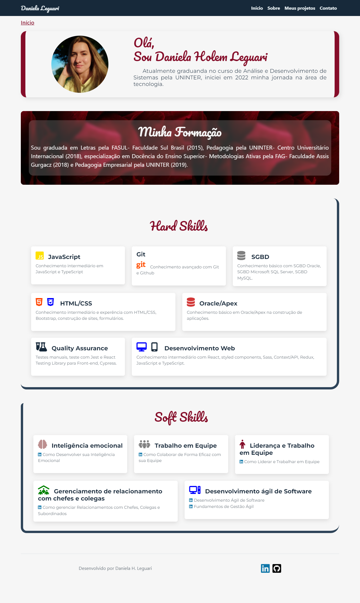
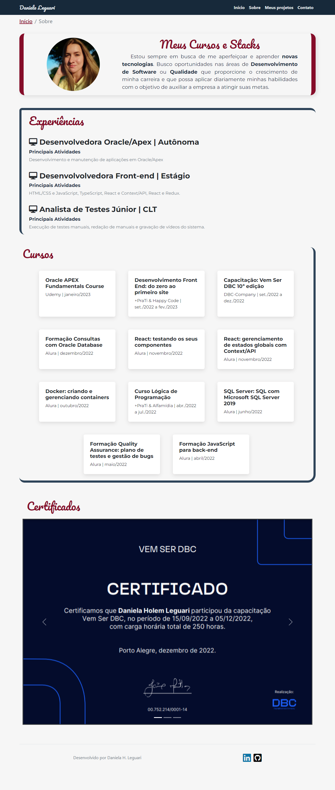
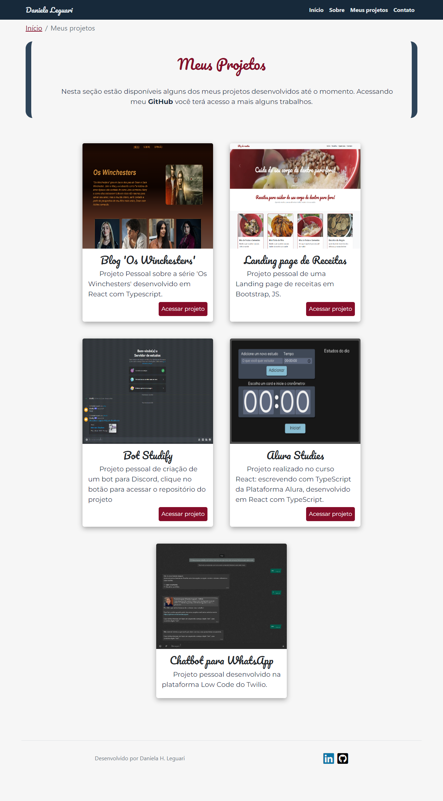
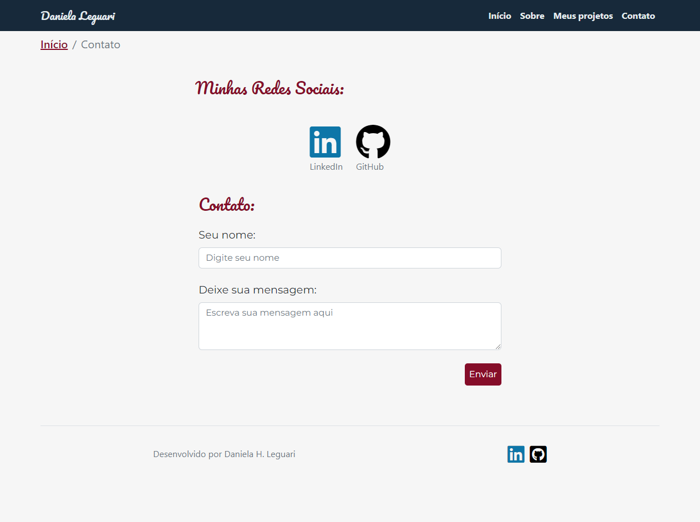
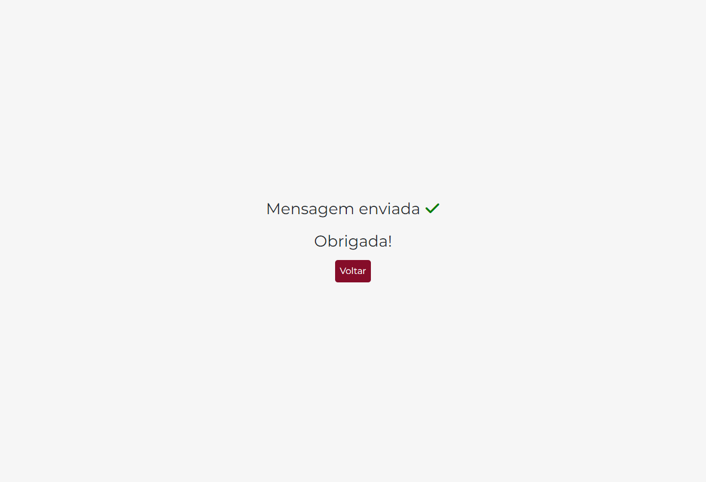

# Projeto Portfólio

- Trabalho final do curso Desenvolvedor Front-End: do zero ao primeiro site do +PraTi by Happy Code.

## Tecnologias utilizadas

 
 
  
  
   
                 

*******
# Estrutura básica

 1. [Página Início](#inicio)
 2. [Página Sobre](#sobre)
 3. [Página Projetos](#projetos)
 4. [Página Contato](#contato)
 5. [Página Obrigado](#obrigado)
 6. [Bootstrap](#bootstrap)
 7. [Layout do projeto](#layout)

*******

## O projeto é composto pelas páginas:

 

### 1. Página Início

-  Composta por um header fixado, uma seção com breadcrumb, um article de apresentação, seção formação utilizando glassmorphism, seção de hard skills, seção de soft skills e um footer com ícones que dão acesso as redes sociais.

*******

 

### 2. Página Sobre 

- Composta por um header fixado, uma seção com breadcrumb, uma seção de apresentação com um breve comentário sobre as oportunidades de meu interesse. Em seguida, a sessão com as minhas experiências, seção de cursos, um carrossel com certificados e um footer com ícones que dão acesso as redes sociais.

*******

 

### 3. Página Meus Projetos

-  Composta por um header fixado, uma seção com breadcrumb, por uma breve apresentação dos projetos, na sequência são apresentados uma sessão com os cards com os projetos que são carregados dinamicamente com JavaScript. Cada card possui um botão que ao clicá-lo abrirá uma nova página com o projeto exeto o card com o chatbot do whatsApp, pois a aplicação foi feita na plataforma Low Code Twilio. Para finalizar o footer com ícones que dão acesso as redes sociais.

*******

 

### 4. Página de Contatos

- A página de contatos é composta por um header fixado, uma seção com breadcrumb. No corpo na página temos uma sessão com as redes sociais que ao clicar vão direto para a página da rede social(em nova guia). A segunda seção é a de contato que ao preencher os dados e clicar em enviar os mesmos são enviados para o meu e-mail. No formulário foi utilizada a Plataforma de back-end de formulários para designers e desenvolvedores, nesse terminal não é necessário nenhum código de back-end. Para finalizar o footer com ícones que dão acesso as redes sociais.

*******

### 5. Página Obrigado

- Ao preencher o formulário e clicar em enviar o site irá redirecionar para a página de obrigado na qual o usuário poderá voltar(botão) para a página home.

*******

 

# 6. Bootstrap
- A escolha dessa ferramenta se deu pela rapidez na criação de uma aplicação. Seus componentes melhoram a experiência do usuário tornando o site amigável e principalmente RESPONSIVO!

*******

 

# 7. Layout do site

- A escolha do estilo busquei misturar as cores fortes com tons mais claros e ao mesmo tempo apresentar um site simples, objetivo, funcional e responsivo.

*******

 

# 8. Resposividade

